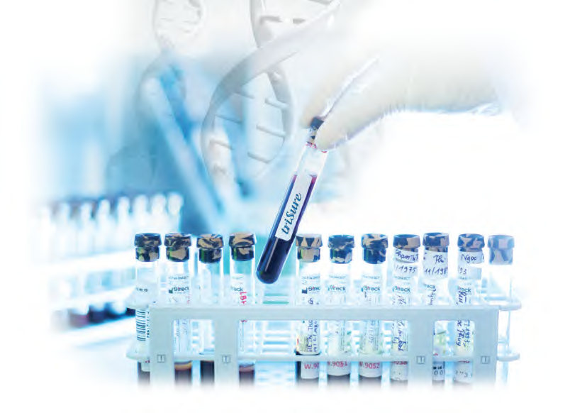

**NIPT (Non-Invasive Prenatal Testing)** là xét nghiệm sàng lọc trước sinh không xâm lấn dựa trên DNA ngoại bào (cfDNA) của nhau thai phóng thích vào trong máu mẹ nhằm phát hiện các dị tật bẩm sinh phổ biến do bất thường số lượng nhiễm sắc thể (như Tam nhiễm sắc thể 21, 18, 13...).

Xét nghiệm có thể được thực hiện rất sớm, ngay khi thai nhi được **9 tuần tuổi**.

---

### Quy trình thực hiện gồm 3 bước cơ bản:

1. **Bước 1 - Lấy mẫu:** Lấy mẫu máu tĩnh mạch của người mẹ (khoảng 10ml) và tiến hành tách chiết DNA ngoại bào.
2. **Bước 2 - Giải trình tự:** Tiến hành giải trình tự các phân tử DNA ngoại bào này (bao gồm cả DNA của mẹ và DNA nhau thai).
3. **Bước 3 - Phân tích:** Phân tích dữ liệu bằng phương pháp đếm và các thuật toán chuyên biệt để xác định nguy cơ lệch bội nhiễm sắc thể ở thai nhi.
