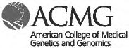
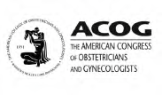
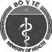
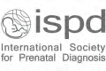

Dưới đây là thống kê so sánh giữa **Sàng lọc sinh hóa** và **NIPT** đối với nhóm thai phụ ước tính (Dữ liệu dựa trên 1.588.404 trẻ sinh ra vào năm 2018 tại Việt Nam, ước tính khoảng 1.667 thai bị hội chứng Down).

### So sánh tổng quan quy trình

| Tiêu chí                                  | Sàng lọc sinh hóa | Sàng lọc NIPT |
| :---------------------------------------- | :---------------: | :-----------: |
| **Tỷ lệ phát hiện**                       |      **85%**      |    **99%**    |
| **Tỷ lệ dương tính giả**                  |      **5%**       |   **0.05%**   |
| **Số ca dương tính giả cần chọc ối**      |     51.333 ca     |   2.149 ca    |
| **Số ca bị bỏ sót (âm tính giả)**         |      250 ca       |     17 ca     |
| **Số thai bình thường bị sảy do chọc ối** |     513 thai      |    21 thai    |

  
  
  
  

---

### Tài liệu tham khảo

- _Siljee, Jacqueline E., et al. "Positive predictive values for detection of trisomies 21, 18 and 13 and termination of pregnancy rates after referral for advanced maternal age, first trimester combined test or ultrasound abnormalities in a national screening programme (2007–2009)." Prenatal diagnosis 34.3 (2014): 259-264._
- _Grace, Matthew R., et al. "Cell-free DNA screening: complexities and challenges of clinical implementation." Obstetrical & gynecological survey 71.8 (2016): 477._
