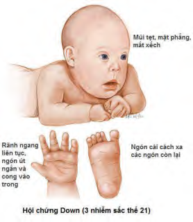

**Hội chứng Down (Tam nhiễm sắc thể 21)** là dị tật bẩm sinh do bất thường số lượng nhiễm sắc thể phổ biến nhất ở trẻ sơ sinh còn sống.

- **Tần suất:** Cứ 700 trẻ sơ sinh còn sống sẽ có 1 trẻ mắc hội chứng Down.
- **Biểu hiện lâm sàng:** Mức độ biểu hiện có thể khác nhau ở mỗi trẻ.

### Đặc điểm thường gặp:

- Chậm phát triển và khuyết tật trí tuệ ở mức nhẹ đến vừa.
- Đặc điểm khuôn mặt đặc trưng: Mũi tẹt, mặt phẳng, mắt xếch.
- Rãnh ngang liên tục ở lòng bàn tay (nếp gấp khỉ), ngón út ngắn và/hoặc cong vào trong.
- Ngón chân cái cách xa các ngón còn lại.
- Dị tật về cấu trúc tim bẩm sinh.
- Giảm trương lực cơ.
- Có thể sống tới tuổi trưởng thành.

---

### Tài liệu tham khảo

- _Jones KL, Jones MC, del Campo M. Smith’s Recognizable Patterns of Human Malformation. 7th ed. Philadelphia: Elsevier Saunders; 2013._
- _Your guide to understanding genetic conditions: Down syndrome. Genetics Home Reference._
- _Anne BS Giersch. Congenital cytogenetic abnormalities. Uptodate, 2020._
