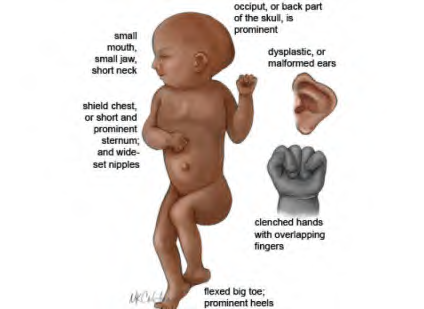

**Hội chứng Edwards (Tam nhiễm sắc thể 18)** là dị tật bẩm sinh do bất thường số lượng nhiễm sắc thể phổ biến thứ hai ở trẻ sơ sinh còn sống.

- **Tần suất:** Cứ 5.000 trẻ sơ sinh còn sống sẽ có 1 trẻ mắc hội chứng Edwards.
- **Tiên lượng:** Tuổi thọ thường rất thấp, phần lớn dưới một tuổi.
- **Biểu hiện lâm sàng:** Biểu hiện lâm sàng có thể khác nhau và rất nghiêm trọng.

### Đặc điểm thường gặp:

- Chậm phát triển nghiêm trọng trong tử cung.
- Trương lực cơ tăng.
- Bất thường cấu trúc bàn tay và/hoặc bàn chân: Các ngón tay quặp chặt, thiểu sản móng tay, lòng bàn chân dày hình thuyền.
- Đầu hình trái dâu, trán bé, khe mắt hẹp, tai dị hình và đóng thấp.
- Dị tật nặng ở tim, thận và các cơ quan nội tạng khác.
- Chậm phát triển và khuyết tật trí tuệ cực kỳ nghiêm trọng.

---

### Tài liệu tham khảo

- _Jones KL, Jones MC, del Campo M. Smith’s Recognizable Patterns of Human Malformation. 7th ed. Philadelphia: Elsevier Saunders; 2013._
- _Your guide to understanding genetic conditions: Trisomy 18. Genetics Home Reference._
