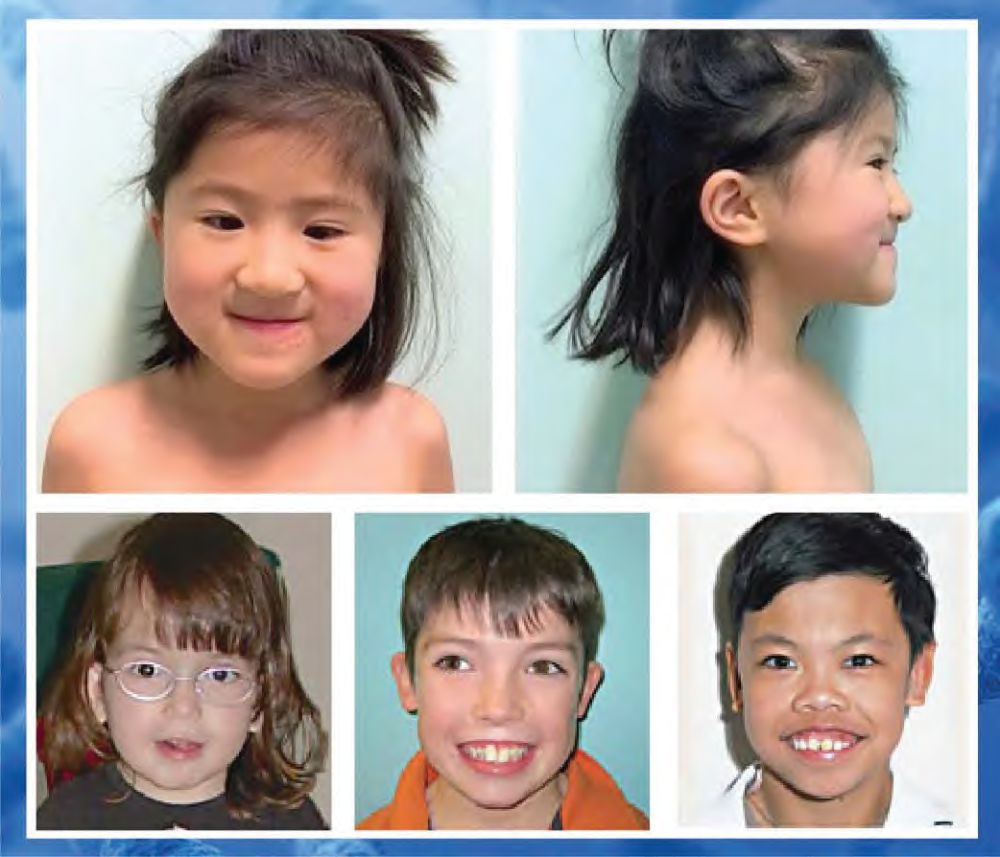

Bất thường nhiễm sắc thể (NST) xảy ra khi thai nhi bị thừa, thiếu nguyên một nhiễm sắc thể (lệch bội) hoặc bị mất đi một đoạn nhỏ trên cấu trúc nhiễm sắc thể (vi mất đoạn).

Xét nghiệm triSure NIPT tập trung sàng lọc các nhóm bất thường nhiễm sắc thể phổ biến và nghiêm trọng nhất:

### 1. Tam nhiễm sắc thể phổ biến (Trisomies)

- **Hội chứng Down** (Tam nhiễm sắc thể 21)
- **Hội chứng Edwards** (Tam nhiễm sắc thể 18)
- **Hội chứng Patau** (Tam nhiễm sắc thể 13)

### 2. Bất thường số lượng nhiễm sắc thể giới tính

- **Hội chứng Turner** (Thể đơn nhiễm X - XO)
- **Hội chứng Triple X** (47, XXX)
- **Hội chứng Klinefelter** (47, XXY)
- **Biến thể nặng hơn của Klinefelter** (48, XXXY)
- **Hội chứng Jacobs** (47, XYY)

### 3. Tam nhiễm sắc thể hiếm khác (RATs)

- Sàng lọc các lệch bội số lượng trên các cặp nhiễm sắc thể còn lại (ngoài 13, 18, 21, X, Y).

### 4. Hội chứng vi mất đoạn nhiễm sắc thể (Microdeletions)

- **Hội chứng DiGeorge** (Mất đoạn 22q11.2)
- **Hội chứng Mất đoạn 1p36**
- **Hội chứng Cri-du-chat** (Mất đoạn 5p)
- **Hội chứng Angelman** (Mất đoạn 15q11-q13 từ mẹ)
- **Hội chứng Prader-Willi** (Mất đoạn 15q11-q13 từ cha)
