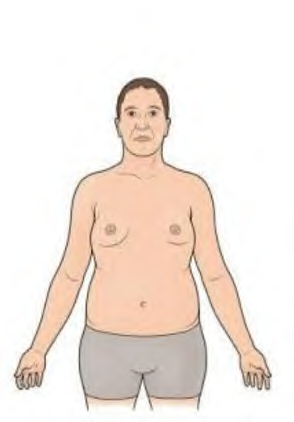

**Hội chứng Jacobs (47,XYY)** xảy ra ở nam giới khi có thêm một nhiễm sắc thể Y phụ trong tế bào.

- **Tần suất:** Xuất hiện với tỷ lệ khoảng 1/1.000 trẻ sơ sinh nam còn sống.
- **Biểu hiện lâm sàng:** Biểu hiện lâm sàng có thể khác nhau. Nhiều người mắc hội chứng Jacobs có cuộc sống hoàn toàn bình thường và khả năng sinh sản không bị ảnh hưởng.

### Đặc điểm thường gặp:

- Chiều cao cao hơn chiều cao trung bình.
- Khó khăn khi học tập, nói, chậm phát triển ngôn ngữ.
- Tăng nguy cơ mắc chứng tăng động giảm chú ý (ADHD) và các rối loạn phổ tự kỷ (ASD).
- Khả năng sinh sản thông thường là hoàn toàn bình thường.

---

### Tài liệu tham khảo

- _Jones KL, Jones MC, del Campo M. Smith’s Recognizable Patterns of Human Malformation. 7th ed. Philadelphia: Elsevier Saunders; 2013._
- _Your guide to understanding genetic conditions: Klinefelter Syndrome. Genetics Home Reference._
