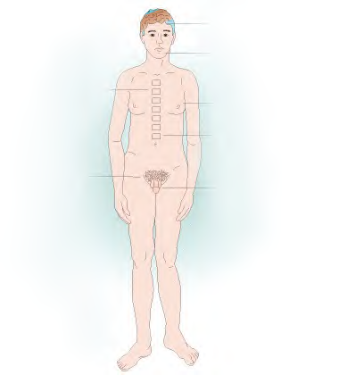

**Hội chứng Klinefelter (47,XXY)** xảy ra ở nam giới khi có thêm một nhiễm sắc thể X trong bộ nhiễm sắc thể.

- **Tần suất:** Cứ 650 trẻ sơ sinh nam còn sống sẽ có 1 trẻ mắc hội chứng Klinefelter.
- **Biểu hiện lâm sàng:** Biểu hiện lâm sàng có thể khác nhau và thường trở nên rõ rệt hơn sau tuổi dậy thì.

### Đặc điểm thường gặp:

- Tầm vóc cao, vóc dáng hơi nữ tính, loãng xương.
- Giảm khả năng hoặc có xu hướng mất lông ngực, tăng trưởng râu kém.
- Tuyến vú phát triển (vú to ở nam giới).
- Kiểu lông mu phân bố kiểu nữ.
- Tinh hoàn kém phát triển (teo tinh hoàn), giảm nồng độ testosterone, dẫn đến vô sinh ở nam giới.
- IQ có thể suy giảm nhẹ, gặp khó khăn khi học tập, nói và chậm phát triển ngôn ngữ.

---

### Tài liệu tham khảo

- _Jones KL, Jones MC, del Campo M. Smith’s Recognizable Patterns of Human Malformation. 7th ed. Philadelphia: Elsevier Saunders; 2013._
- _Your guide to understanding genetic conditions: Klinefelter Syndrome. Genetics Home Reference._
