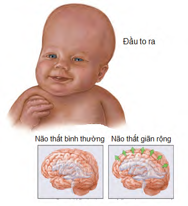

**Hội chứng Triple X (47,XXX)** xảy ra ở nữ giới khi có thêm một nhiễm sắc thể X thứ ba trong các tế bào.

- **Tần suất:** Cứ 1.000 trẻ sơ sinh nữ còn sống sẽ có 1 trẻ mắc hội chứng Triple X.
- **Biểu hiện lâm sàng:** Nhiều người nữ bị 47,XXX không có biểu hiện đặc điểm rõ ràng ra ngoài, do đó thường không được phát hiện. Phần lớn người nữ mắc hội chứng này có hình thể và khả năng sinh sản hoàn toàn bình thường.

### Đặc điểm thường gặp (khi có biểu hiện):

- Chiều cao cao hơn chiều cao trung bình.
- Khó khăn khi học tập, nói, chậm phát triển ngôn ngữ.
- Chậm phát triển các kỹ năng vận động tinh và thô.
- Gặp một số khó khăn về hành vi và cảm xúc.
- Một số ít trường hợp có bất thường về phát triển giới tính và khả năng sinh sản.
- Có thể gặp tình trạng não thất giãn rộng.

---

### Tài liệu tham khảo

- _Jones KL, Jones MC, del Campo M. Smith’s Recognizable Patterns of Human Malformation. 7th ed. Philadelphia: Elsevier Saunders; 2013._
- _Your guide to understanding genetic conditions: Triple X Syndrome. Genetics Home Reference._
