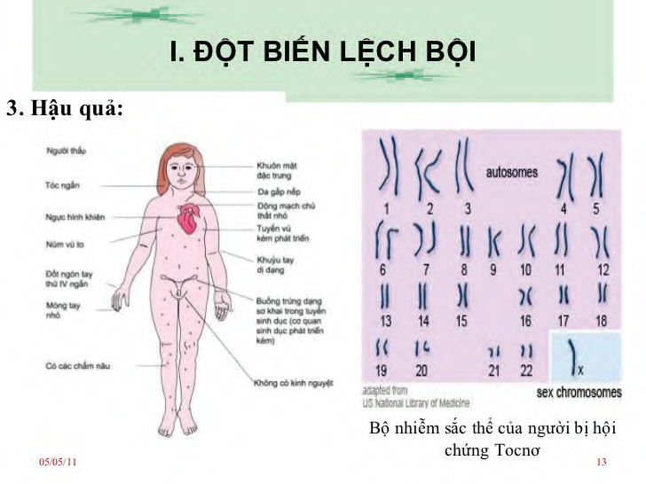

**Hội chứng Turner (Thể đơn nhiễm X - XO)** là bất thường nhiễm sắc thể giới tính ở nữ giới khi chỉ có một nhiễm sắc thể X hoạt động bình thường. Nhiều thai nhi thể đơn nhiễm X bị sẩy thai tự nhiên.

- **Tần suất:** Cứ 2.000 trẻ sơ sinh nữ còn sống sẽ có 1 trẻ mắc hội chứng Turner.
- **Biểu hiện lâm sàng:** Biểu hiện lâm sàng có thể khác nhau giữa các cá nhân.

### Đặc điểm thường gặp:

- Chiều cao thấp rõ rệt.
- Rối loạn chức năng buồng trứng dẫn đến mất kinh nguyệt tự nhiên và vô sinh. Buồng trứng dạng sơ khai trong tuyến sinh dục, cơ quan sinh dục phát triển kém.
- Các chấm nâu trên da.
- Dị tật về cấu trúc tim (như hẹp eo động mạch chủ, van động mạch chủ hai lá).
- Ngực hình khiên, núm vú khoảng cách rộng.
- Da cổ gấp nếp (cổ bành), tóc mọc thấp ở phía sau.
- Khuỷu tay dị dạng (vẹo ra ngoài), đốt ngón tay thứ IV ngắn, móng tay nhỏ.

---

### Tài liệu tham khảo

- _Hook EB, Warburton D. Hum Genet. 2014;133(4):417-424._
- _Jones KL, Jones MC, del Campo M. Smith’s Recognizable Patterns of Human Malformation. 7th ed. Philadelphia: Elsevier Saunders; 2013._
- _Your guide to understanding genetic conditions: Turner syndrome. Genetics Home Reference._
