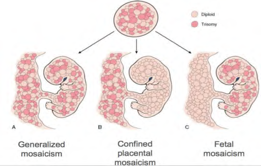

Mặc dù NIPT là xét nghiệm sàng lọc trước sinh có độ chính xác cực kỳ cao (>99%), xét nghiệm vẫn có những giới hạn chuyên môn nhất định do bản chất sinh học của thai kỳ:

### 1. Các trường hợp KHUYẾN CÁO KHÔNG NÊN thực hiện NIPT:

Trong các trường hợp dưới đây, thai phụ nên bỏ qua xét nghiệm sàng lọc NIPT và tiến hành thực hiện **Chẩn đoán trước sinh xâm lấn (chọc ối hoặc sinh thiết gai nhau)** trực tiếp để đảm bảo chẩn đoán chính xác:

- **Siêu âm phát hiện bất thường về cấu trúc thai:** Có ít nhất 1 bất thường lớn (như dị tật tim, sứt môi chẻ vòm, thoát vị rốn...) hoặc ít nhất 2 bất thường nhỏ trên siêu âm hình thái.
- **Thai có độ mờ da gáy (Nuchal Translucency - NT) dày:** Chỉ số đo độ mờ da gáy **> 3.5mm**.
- **Kết quả sàng lọc Combined Test có giá trị nguy cơ cực kỳ cao:** Chỉ số nguy cơ **> 1/50**.
- **Hiện tượng song thai tiêu biến:** Có thể làm nhiễu tín hiệu DNA tự do trong máu mẹ do sự phóng thích DNA liên tục từ bánh nhau của thai đã tiêu biến.

---

### 2. Hiện tượng khảm nhiễm sắc thể (Mosaicism)

NIPT phân tích các mảnh DNA tự do phóng thích từ **bánh nhau (nhau thai)** vào máu mẹ, không phải trực tiếp từ tế bào thai nhi. Do đó, hiện tượng khảm (sự tồn tại của hai hoặc nhiều dòng tế bào có bộ NST khác nhau) có thể gây ra sai lệch kết quả:

- **Thể khảm khu trú bánh nhau (Confined Placental Mosaicism - CPM):**
  - Tình trạng bộ nhiễm sắc thể bất thường chỉ xuất hiện ở các tế bào bánh nhau, trong khi cơ thể thai nhi hoàn toàn bình thường.
  - Đây là nguyên nhân chính dẫn tới kết quả **Dương tính giả** trên NIPT (xét nghiệm báo nguy cơ cao nhưng chọc ối kiểm tra thai lại bình thường).
- **Thể khảm ở thai (Fetal Mosaicism):**
  - Tình trạng bộ nhiễm sắc thể bất thường chỉ xuất hiện ở các tế bào thai nhi, trong khi bánh nhau hoàn toàn bình thường.
  - Đây là nguyên nhân chính dẫn tới kết quả **Âm tính giả** trên NIPT (xét nghiệm báo nguy cơ thấp nhưng trẻ sinh ra lại mắc hội chứng di truyền).

---

_\* Tài liệu tham khảo:_

- _Grati FR. J Clin Med. 2014;3(3):809-837._
- _Van Opstal D, et al. PLoS One. 2016;11(1):e0146794._
- _Kalousek DK. Pediatr Pathol. 1990;10(1-2):69-77._
