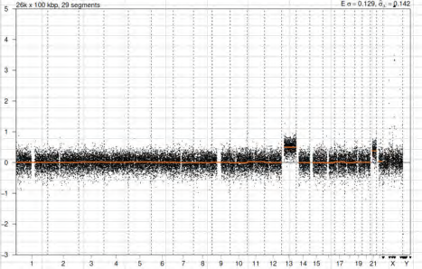
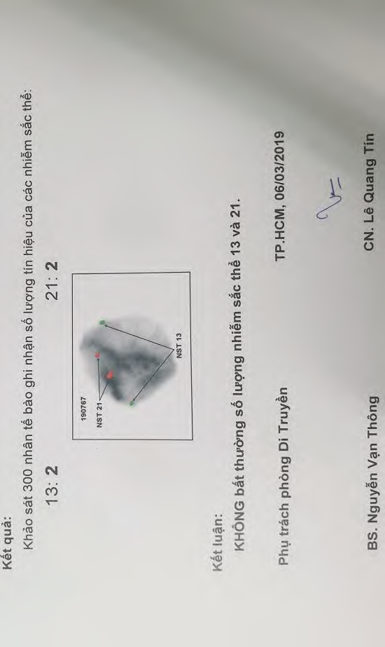
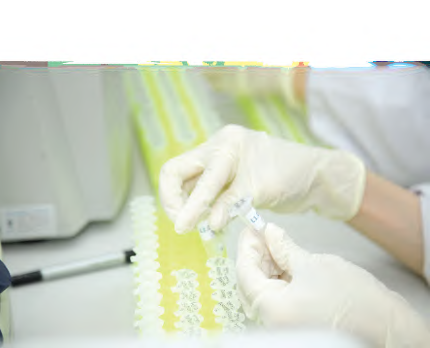

### 1. Tổng quan lý thuyết

**Thể khảm (Mosaicism)** là hiện tượng trong đó một cơ thể hoặc một mô sở hữu ít nhất hai dòng tế bào trở lên mang bộ nhiễm sắc thể khác biệt nhau.

**Khảm khu trú bánh nhau (Confined Placental Mosaicism - CPM)** xảy ra khi dòng tế bào mang đột biến bất thường nhiễm sắc thể chỉ tồn tại khu trú trong các tế bào bánh nhau (nhau thai), trong khi các tế bào cấu thành cơ thể thai nhi lại hoàn toàn có bộ nhiễm sắc thể bình thường.


---

### 2. Chi tiết ca lâm sàng

- **Đối tượng:** Thai phụ thực hiện xét nghiệm sàng lọc trước sinh **triSure3** lúc thai **27 tuần tuổi**.
- **Kết quả xét nghiệm triSure3:** Phát hiện nguy cơ cao bất thường lệch bội **Trisomy 13 (Tam nhiễm sắc thể 13)**:
  - Chỉ số nguy cơ **Z-score (NST 13) = 7.51** (Ngưỡng nguy cơ cao khi Z-score ≥ 3).
  - Các nhiễm sắc thể 18 và 21 có chỉ số nguy cơ thấp bình thường.

<div style="display: flex; flex-direction: row; flex-wrap: wrap; justify-content: center; gap: 15px; margin: 20px 0;">
  
  
</div>

```
+----------------------------------------+
| NHIỄM SẮC THỂ  | Z-SCORE | KẾT LUẬN     |
|----------------|---------|--------------|
| Trisomy 21     | -0.50   | Nguy cơ thấp |
| Trisomy 18     |  0.86   | Nguy cơ thấp |
| Trisomy 13     |  7.51   | Nguy cơ cao  |
+----------------------------------------+
```

---

### 3. Quy trình can thiệp và chẩn đoán khẳng định



1. **Chọc ối chẩn đoán:** Sau khi nhận kết quả nguy cơ cao, thai phụ được tư vấn thực hiện thủ thuật chọc ối tại bệnh viện chuyên khoa phụ sản để làm xét nghiệm khẳng định.
2. **Xét nghiệm FISH trên dịch ối:**
   - Mẫu dịch ối được gửi làm xét nghiệm lai huỳnh quang tại chỗ (FISH) tại Bệnh viện Hùng Vương nhằm khảo sát số lượng nhiễm sắc thể 13 và 21.
   - **Kết quả FISH:** Khảo sát 300 nhân tế bào ghi nhận số lượng tín hiệu NST 13 và 21 đều bình thường (mỗi tế bào có đúng 2 tín hiệu). Kết luận: **KHÔNG phát hiện bất thường số lượng nhiễm sắc thể 13 và 21 ở thai nhi**.
3. **Theo dõi sau sinh:** Thai phụ tiếp tục khám thai định kỳ và theo dõi siêu âm hình thái học bình thường cho đến khi sinh nở mẹ tròn con vuông.
4. **Xét nghiệm sinh thiết bánh nhau sau sinh:**
   - Ngay sau khi sinh, các bác sĩ tiến hành sinh thiết bánh nhau tại 3 vị trí khác nhau để gửi làm xét nghiệm **CNVSure** (khảo sát số lượng 23 cặp NST).
   - **Kết quả CNVSure bánh nhau:** Phát hiện bất thường lệch bội **Trisomy 13**.

---

### 4. Kết luận lâm sàng

Đây là một trường hợp **Dương tính giả điển hình của NIPT do hiện tượng khảm khu trú bánh nhau (CPM)**.

Do xét nghiệm NIPT phân tích các mảnh DNA tự do phóng thích vào máu mẹ chủ yếu có nguồn gốc từ các tế bào lá nuôi của bánh nhau (không phải trực tiếp từ tế bào thai), sự bất thường nhiễm sắc thể ở bánh nhau (Trisomy 13) đã tạo ra tín hiệu dương tính trên NIPT, trong khi cơ thể bé hoàn toàn khỏe mạnh bình thường.

> **Khuyến nghị lâm sàng:** NIPT luôn là xét nghiệm sàng lọc có độ chính xác cực cao nhưng không phải là xét nghiệm chẩn đoán. Khi có kết quả NIPT dương tính, bắt buộc phải thực hiện chọc ối để chẩn đoán xác định trước khi đưa ra bất kỳ quyết định đình chỉ thai nghén nào.
