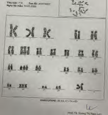
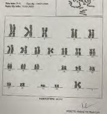
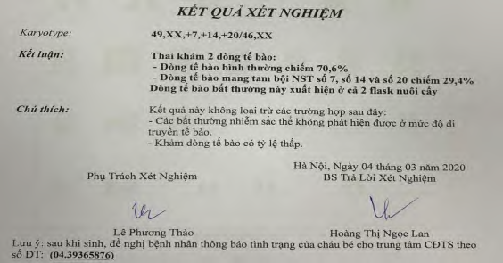
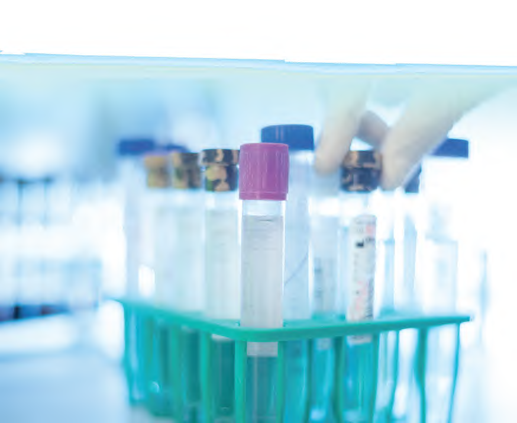

### 1. Tổng quan lý thuyết

Bản chất di truyền của bánh nhau và thai nhi có thể khác biệt nhau trong một số ít trường hợp. Khi thai bị khảm (Fetal Mosaicism), cơ thể thai nhi sẽ đồng thời mang cả dòng tế bào bình thường và dòng tế bào bất thường, trong khi các tế bào ở bánh nhau lại hoàn toàn bình thường.

Vì NIPT dựa trên DNA tự do giải phóng từ bánh nhau, trường hợp thai bị khảm nhưng bánh nhau bình thường sẽ dẫn đến kết quả **Âm tính giả** trên NIPT.

---

### 2. Chi tiết ca lâm sàng

- **Đối tượng:** Thai phụ thực hiện xét nghiệm sàng lọc trước sinh **triSure NIPT** lúc thai **11.5 tuần tuổi**.
- **Kết quả xét nghiệm triSure NIPT:** Kết quả báo **Nguy cơ thấp (Âm tính)** đối với tất cả các hội chứng lệch bội phổ biến và lệch bội nhiễm sắc thể giới tính:
  - Z-score (Trisomy 21) = -0.52 (Nguy cơ thấp)
  - Z-score (Trisomy 18) = -0.85 (Nguy cơ thấp)
  - Z-score (Trisomy 13) = 0.02 (Nguy cơ thấp)

---

### 3. Quy trình phát hiện và chẩn đoán khẳng định

  
  
  

1. **Bất thường siêu âm ở tuần 22:** Khi khám thai và siêu âm hình thái học định kỳ ở tuần thai thứ 22, bác sĩ phát hiện thai nhi có các dấu hiệu bất thường nghiêm trọng:
   - Động mạch phổi nhỏ bất thường.
   - Bụng thai nhi xuất hiện nhiều dịch (tràn dịch màng bụng).

2. **Chọc ối chẩn đoán:** Bác sĩ chỉ định thực hiện thủ thuật chọc ối khẩn cấp để làm xét nghiệm lập karyotype tế bào ối.
3. **Kết quả Karyotype dịch ối:** Phát hiện thai bị **khảm 2 dòng tế bào**:
   - **Dòng tế bào bình thường:** Chiếm tỷ lệ **70.6%**.
   - **Dòng tế bào bất thường mang đa tam nhiễm (Trisomy 7, 14, và 20):** Chiếm tỷ lệ **29.4%**.
4. **Kết quả kiểm tra ngoại kiểm tin sinh học:**
   - Tiến hành chạy lại mẫu máu mẹ trên hệ thống Ion Torrent độc lập.
   - Kết quả phân tích DNA tự do nhau thai vẫn ghi nhận hàm lượng nhiễm sắc thể 13, 18, 21, giới tính và các NST khác hoàn toàn bình thường (tương đồng 100% với kết quả sàng lọc ban đầu).

---

### 4. Kết luận lâm sàng

Đây là trường hợp **Âm tính giả của NIPT do hiện tượng khảm ở thai (Fetal Mosaicism)**.

Bánh nhau của thai kỳ hoàn toàn bình thường, giải phóng các mảnh DNA tự do bình thường vào máu mẹ khiến NIPT báo kết quả âm tính. Tuy nhiên, bản thân thai nhi lại bị khảm dòng tế bào bất thường chiếm 29.4%, gây ra các dị tật bẩm sinh nghiêm trọng phát hiện trên siêu âm tuần 22.

> **Khuyến nghị lâm sàng:** Kết quả NIPT âm tính (nguy cơ thấp) không loại trừ hoàn toàn tất cả các bất thường di truyền ở thai nhi (đặc biệt là thể khảm). Do đó, thai phụ bắt buộc phải tiếp tục duy trì lịch trình khám thai và siêu âm hình thái học định kỳ nghiêm ngặt suốt thai kỳ.
