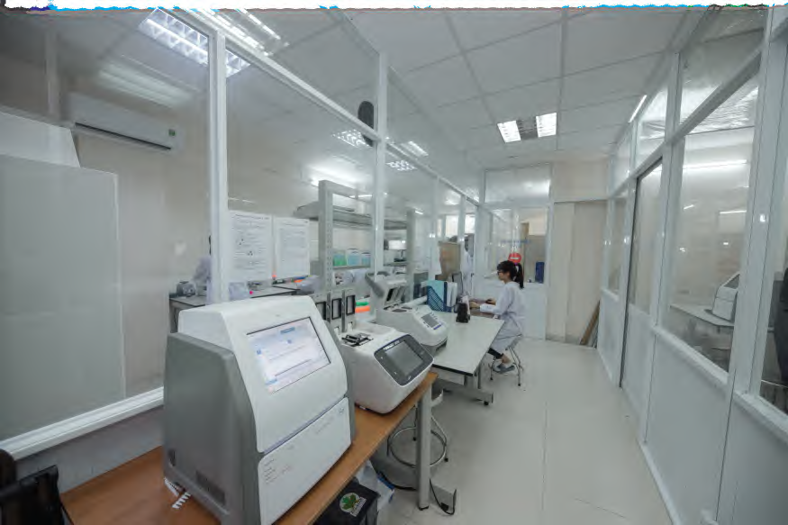
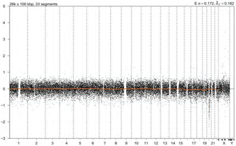

### 1. Tổng quan lý thuyết

Xét nghiệm NIPT thông thường chủ yếu tập trung khảo sát các bất thường về **số lượng** nhiễm sắc thể của thai nhi (thừa hoặc thiếu nguyên một nhiễm sắc thể như Trisomy 13, 18, 21, lệch bội giới tính).

Các bất thường về **cấu trúc** nhiễm sắc thể (như vi mất đoạn nhỏ ngoài mục tiêu, vi lặp đoạn, đảo đoạn, chuyển đoạn cân bằng...) hoặc đột biến điểm trên gen nằm ngoài mục tiêu sàng lọc của gói NIPT cơ bản sẽ không được phát hiện, dẫn đến kết quả âm tính giả về mặt lâm sàng.

---

### 2. Chi tiết ca lâm sàng

- **Đối tượng:** Thai phụ thực hiện xét nghiệm **triSure NIPT** lúc thai **13 tuần tuổi**.
- **Kết quả xét nghiệm triSure NIPT:** Đạt kết quả **Nguy cơ thấp (Âm tính)** đối với tất cả các nhóm lệch bội khảo sát:
  - Z-score (NST 21) = -1.24 (Nguy cơ thấp)
  - Z-score (NST 18) = -0.25 (Nguy cơ thấp)
  - Z-score (NST 13) = -0.69 (Nguy cơ thấp)

---

### 3. Quy trình phát hiện và chẩn đoán khẳng định

1. **Bất thường siêu âm tuần 23:** Khi tiến hành siêu âm hình thái học ở thời điểm thai được 23 tuần 5 ngày, bác sĩ phát hiện thai nhi có các bất thường cấu trúc rất nặng:
   - Thai nhi bị chậm tăng trưởng nghiêm trọng trong tử cung (IUGR).
   - Dị tật tim bẩm sinh phức tạp: **Kênh nhĩ thất hoàn toàn**.
2. **Chọc ối chẩn đoán:** Bác sĩ chỉ định thực hiện thủ thuật chọc ối để làm xét nghiệm phân tích chuyên sâu **CNV-Seq** (khảo sát các vi mất/lặp đoạn kích thước nhỏ trên toàn bộ 23 cặp NST).
3. **Kết quả CNV-Seq dịch ối:** Phát hiện bất thường cấu trúc nhiễm sắc thể rất nặng:
   - **Phát hiện vi mất đoạn trên nhiễm sắc thể số 20 (del(20)(q11.21-q12))**.
   - Đây là nguyên nhân trực tiếp gây ra dị tật tim kênh nhĩ thất và chậm tăng trưởng ở thai nhi.

---

### 4. Kết luận lâm sàng

Ca lâm sàng này minh chứng cho **giới hạn kỹ thuật của xét nghiệm NIPT**. NIPT cơ bản chỉ sàng lọc các bất thường số lượng NST phổ biến. Các bất thường cấu trúc nhỏ (vi mất đoạn nằm ngoài mục tiêu khảo sát) không thể phát hiện được bằng NIPT cơ bản.

> **Khuyến nghị lâm sàng:** Giới hạn này luôn được ghi rõ trong văn bản đồng thuận tự nguyện thực hiện xét nghiệm triSure NIPT. Khi siêu âm phát hiện dị tật cấu trúc thai nặng, dù kết quả NIPT trước đó có âm tính, bác sĩ luôn bắt buộc chỉ định chọc ối làm xét nghiệm chẩn đoán độ phân giải cao (như CNV-Seq hoặc Microarray) để tìm nguyên nhân chính xác.
